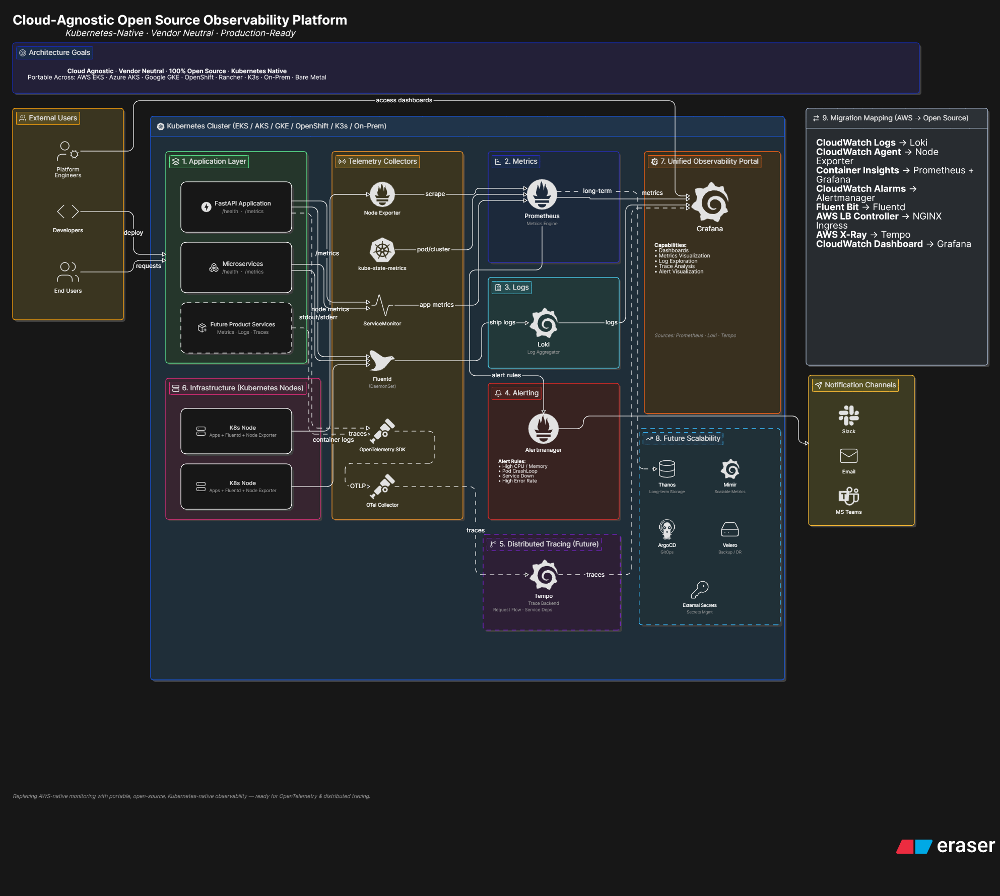

# Architecture.md

# Cloud-Agnostic Open Source Observability Platform Architecture

## 1. Architecture Overview

The Cloud-Agnostic Open Source Observability Platform is a Kubernetes-native observability solution designed to provide monitoring, logging, alerting, and future distributed tracing capabilities without relying on any cloud provider-specific services.

The platform is portable across:

* AWS EKS
* Azure AKS
* Google GKE
* OpenShift
* Rancher
* K3s
* On-Prem Kubernetes
* Bare Metal Kubernetes

The design follows an open-source-first approach and eliminates dependence on cloud-native monitoring services.

---

# 2. High-Level Architecture

## Monitoring Flow

FastAPI Application

↓

Metrics Endpoint (/metrics)

↓

ServiceMonitor

↓

Prometheus

↓

Grafana

---

## Logging Flow

FastAPI Application

↓

Container stdout/stderr

↓

Promtail

↓

Loki

↓

Grafana

---

## Alerting Flow

Prometheus

↓

PrometheusRule

↓

Alertmanager

↓

Slack / Email / Microsoft Teams

---

## Future Tracing Flow

FastAPI Application

↓

OpenTelemetry SDK

↓

OpenTelemetry Collector

↓

Tempo

↓

Grafana

---

# 3. Platform Components

## 3.1 Prometheus

### Purpose

Prometheus serves as the central metrics collection and storage engine.

### Responsibilities

* Scrape application metrics
* Scrape Kubernetes metrics
* Store time-series data
* Evaluate alert rules
* Forward alerts to Alertmanager

### Metrics Collected

Application Metrics

* Request count
* Request duration
* Error rate
* Throughput

Infrastructure Metrics

* Node metrics
* Pod metrics
* Deployment metrics
* Service metrics

### AWS Component Replaced

* CloudWatch Metrics
* Container Insights Metrics

---

## 3.2 Grafana

### Purpose

Grafana provides visualization and observability dashboards.

### Responsibilities

* Display Prometheus metrics
* Display Loki logs
* Display Tempo traces (future)
* Display alert status
* Create custom dashboards

### Benefits

* Unified observability portal
* Multi-data-source support
* Custom dashboard creation
* Role-based access

### AWS Component Replaced

* CloudWatch Dashboard

---

## 3.3 Loki

### Purpose

Loki stores and indexes application and infrastructure logs.

### Responsibilities

* Receive logs from Promtail
* Store logs
* Enable log searching
* Enable log filtering

### Benefits

* Lower storage cost
* Grafana integration
* Kubernetes-native design

### AWS Component Replaced

* CloudWatch Logs

---

## 3.4 Promtail

### Purpose

Promtail collects logs from Kubernetes nodes and forwards them to Loki.

### Responsibilities

* Read container logs
* Add Kubernetes metadata
* Forward logs to Loki

### Benefits

* Lightweight
* Native Loki integration
* Automatic pod discovery

### AWS Component Replaced

* Fluent Bit
* CloudWatch Log Agent

---

## 3.5 Alertmanager

### Purpose

Alertmanager manages alert routing and notification delivery.

### Responsibilities

* Receive alerts from Prometheus
* Group alerts
* Deduplicate alerts
* Route notifications

### Supported Destinations

* Slack
* Email
* Microsoft Teams
* PagerDuty
* Webhooks

### AWS Component Replaced

* CloudWatch Alarms
* SNS Notifications

---

## 3.6 kube-state-metrics

### Purpose

Provides Kubernetes object-level metrics.

### Metrics Exposed

* Pod status
* Deployment status
* Replica counts
* StatefulSet status
* DaemonSet status
* PVC status

### AWS Component Replaced

* Container Insights

---

## 3.7 Node Exporter

### Purpose

Provides infrastructure-level metrics.

### Metrics Exposed

* CPU utilization
* Memory utilization
* Disk usage
* Filesystem statistics
* Network statistics

### Production Usage

Enabled in:

* EKS
* AKS
* GKE
* OpenShift
* Rancher
* K3s
* On-Prem

### Local Development

Disabled for Docker Desktop due to mount propagation limitations.

### AWS Component Replaced

* CloudWatch Agent

---

## 3.8 OpenTelemetry Collector (Future)

### Purpose

Unified telemetry collection layer.

### Responsibilities

* Collect metrics
* Collect logs
* Collect traces
* Route telemetry

### Benefits

* Vendor-neutral
* Standardized telemetry pipeline

---

## 3.9 Tempo (Future)

### Purpose

Distributed tracing backend.

### Capabilities

* Request tracing
* Dependency mapping
* Latency analysis
* Root cause investigation

### AWS Component Replaced

* AWS X-Ray

---

# 4. Namespace Architecture

Current Namespace:

observability

Contains:

* Prometheus
* Grafana
* Alertmanager
* Loki
* kube-state-metrics
* FastAPI Demo

Future Recommendation:

* observability
* applications
* monitoring
* logging

---

# 5. Application Onboarding Architecture

## Product Team Responsibilities

Applications must provide:

* Source Code
* Dockerfile
* /health endpoint
* /metrics endpoint
* Resource requirements
* Environment variable documentation

---

## Observability Team Responsibilities

Provide:

* ServiceMonitor
* Dashboards
* Alert Rules
* Log Collection
* Grafana Access

---

# 6. Alerting Architecture

## Alert Flow

Application Metric

↓

Prometheus

↓

Prometheus Rule

↓

Alertmanager

↓

Notification Channel

---

## Alert Severity Levels

### Critical

Examples:

* Service unavailable
* Application crash
* Database unavailable

### Warning

Examples:

* High CPU
* High memory
* Increased latency

### Info

Examples:

* Deployment completed
* Configuration updated

---

# 7. Logging Architecture

## Log Sources

Application Logs

* stdout
* stderr

Kubernetes Logs

* Pod logs
* Container logs

Infrastructure Logs

* Node logs (future)

---

## Log Pipeline

Container

↓

Promtail

↓

Loki

↓

Grafana

---

# 8. Security Architecture

## Authentication

Current:

* Grafana local admin

Future:

* OAuth
* SSO
* LDAP

---

## Authorization

Kubernetes RBAC

Future:

* Team-based Grafana roles
* Namespace-level access control

---

# 9. Persistence Strategy

## Prometheus

Persistent Volume

Retention:

15 Days

---

## Loki

Persistent Volume

Retention:

30 Days

---

## Grafana

Persistent Volume

Retention:

Dashboard metadata

---

# 10. Scalability Roadmap

## Current

Single Cluster

Single Loki Instance

Single Prometheus Instance

---

## Future

### Metrics

Prometheus

↓

Thanos

or

↓

Mimir

---

### Logs

Loki

↓

Distributed Loki

---

### Tracing

Tempo

↓

Distributed Tempo

---

# 11. Disaster Recovery Strategy

Future Components:

* Velero
* Volume Snapshots
* GitOps Backups

Backup Targets:

* Grafana dashboards
* Prometheus configuration
* Alert rules
* Loki configuration

---

# 12. Architecture Principles

## Cloud Agnostic

No cloud-specific dependencies.

## Open Source First

All observability components are open source.

## Kubernetes Native

Uses Kubernetes APIs and operators.

## Portable

Deployable across any CNCF-compliant Kubernetes platform.

## Extensible

Supports future telemetry and tracing requirements.

---

# Conclusion

The platform successfully replaces AWS-native observability services with a fully open-source, Kubernetes-native architecture capable of supporting monitoring, logging, alerting, and future distributed tracing across any cloud or on-premises environment.
